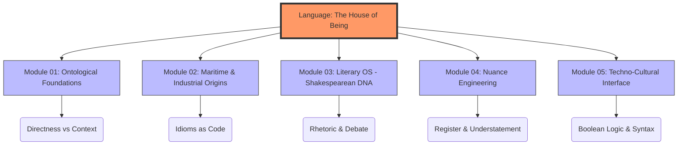

# 🏗️ Cultural-Syntax: Varlığın Evi Olarak İngilizce

---

## 🎯 Proje Manifestosu: "Dil, Hakikatin Evidir"

Bu depo (repository), alışılagelmiş bir dil öğrenme rehberi değildir. Martin Heidegger’in *"Dil, varlığın evidir"* önermesinden yola çıkarak; İngilizceyi yalnızca bir iletişim aracı değil, algıyı, mantığı ve kültürel etkileşimi şekillendiren bir **bilişsel işletim sistemi** olarak ele alır.

Bir dili, o dili doğuran kültürden bağımsız öğrenmek; bir programlama dilinin mimarisini bilmeden sadece sözdizimini (syntax) ezberlemeye benzer. Bu proje, **dilsel yetkinliği (Linguistic Proficiency)**, **kültürel zeka (CQ)** ile entegre ederek İngilizceyi bir "sistem mimarı" derinliğiyle kavramayı hedefler.

---

## 🏛️ Mimari Yapı

Repo, dilin ve kültürün farklı katmanlarını temsil eden beş ana modülden oluşmaktadır:

### 1. `01_Ontolojik_Temeller/`
* **Doğrusallık Mantığı:** Batı'daki "Doğrudan İletişim" modeli ile Doğu'daki bağlam odaklı kültürlerin kıyaslanması.
* **Algı Olarak Zaman (Tense):** İngilizcedeki zaman yapılarının, zamanı nasıl mimari bir öğe olarak gördüğü (Örn: *Present Perfect*’in geçmiş ve gelecek arasında kurduğu köprü).
* **Özne Egemenliği:** Bireyciliğin cümle yapısına ve etken (active) çatı kullanımına etkisi.

### 2. `02_Denizci_ve_Endüstriyel_Etimoloji/`
* **Denizci Çekirdek:** Britanya'nın denizcilik tarihinden doğan deyimlerin kodlarını çözmek (*"Learning the ropes"*, *"Steady as she goes"*).
* **Endüstriyel Motor:** Sanayi Devrimi'nin dili nasıl mekanikleştirdiği ve verimlilik metaforlarını nasıl yerleştirdiği.
* **Küresel İngilizce (Lingua Franca):** İngilizcenin modüler ve adaptif bir küresel protokole dönüşüm süreci.

### 3. `03_Edebiyat_İşletim_Sistemi/`
* **Shakespearean DNA:** Modern İngilizcenin çekirdek yapısını oluşturan 1700'den fazla kelime ve kalıbın analizi.
* **Retorik ve İkna:** Tartışma (debate) kültürü ve hitabetin bir kültürel sütun olarak incelenmesi.
* **Distopik Semantik:** Orwell ve Huxley üzerinden; kelime dağarcığının sınırları ile düşünce özgürlüğü arasındaki ilişki.

### 4. `04_Nüans_Mühendisliği/`
* **Understatement (Hafifletme Sanatı):** İngiliz kültüründeki dolaylı eleştiri ve nezaket dilinin teknik analizi.
* **Örtmece (Euphemism):** Bir kelimenin teknik olarak doğru olsa bile kültürel olarak neden "hatalı" olabileceğinin kavranması.
* **Latince - Germen Ayrımı:** Akademik/üst düzey dil ile halk dili arasındaki katmanlı yapının çözümlenmesi.

### 5. `05_Tekno-Kültürel_Arayüz/`
* **İnovasyonun Dili:** İngilizcenin neden Ar-Ge ve yazılım dünyasının ana dili olduğunun felsefi analizi.
* **Mantık Kapıları ve Syntax:** İngilizce cümle yapısı ile Boolean mantığı ve yazılım algoritmaları arasındaki sinerji.
* **Akademik Egemenlik:** Batı akademisindeki "Eleştirel Düşünce" (Critical Thinking) çerçevesinde yazma ve düşünme disiplini.

---

## 🛠️ Uygulama Stratejisi

Bu repo, dil ediniminde **"Derin Çalışma" (Deep Work)** metodolojisini benimser:

1.  **Kelime Değil Kavram:** 10 kelime ezberlemek yerine, bir kültürel kavramın (Örn: *Fair Play* veya *Serendipity*) yapısı sökülür.
2.  **Emülasyon Olarak İçselleştirme:** Bilişsel çevreyi yüksek sinyalli İngilizce veriyle çevreleyerek bir "kültürel simülasyon" oluşturmak.
3.  **Tersine Mühendislik:** Teknik dökümantasyonları, makaleleri ve felsefi metinleri sadece "içerik" olarak değil, birer "kaynak kod" olarak analiz etmek.

---

## 📜 Öğrenme Felsefesi

> *"Yabancı dil bilmeyen, kendi dilini de bilemez."* — **Goethe**

İngilizceyi kültürüyle deşifre ederek sadece konuşmayı öğrenmiyoruz; dünyayı farklı bir mercekten algılamayı öğreniyoruz. Bu depo, küresel çağda kendi entelektüel krallığını inşa etmek isteyen **"Otodidakt Alimler"** ve **"Dijital Seyyahlar"** için tasarlanmıştır.

---

## 🤝 Katkı Sağlama

Bu proje, zihin için açık kaynaklı bir araştırma laboratuvarıdır. **Etnolinguistik**, **Etimoloji** ve **Teknoloji Felsefesi** konularındaki katkılara açıktır.

---

*“Başka bir dile sahip olmak, ikinci bir ruha sahip olmaktır.”* – **Şarlman**