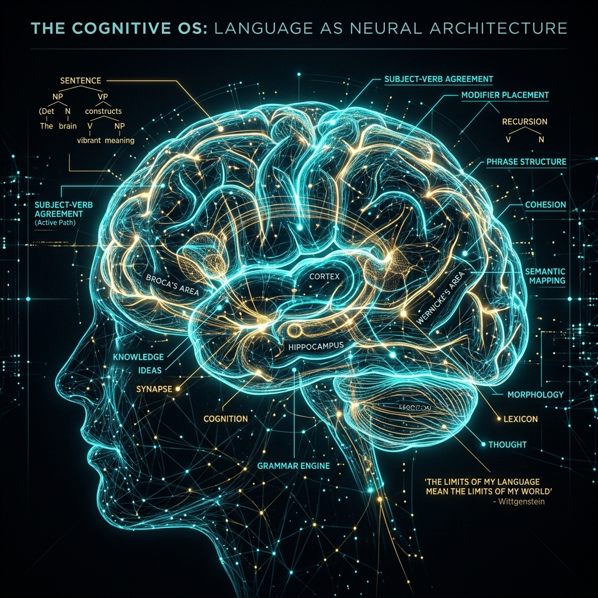
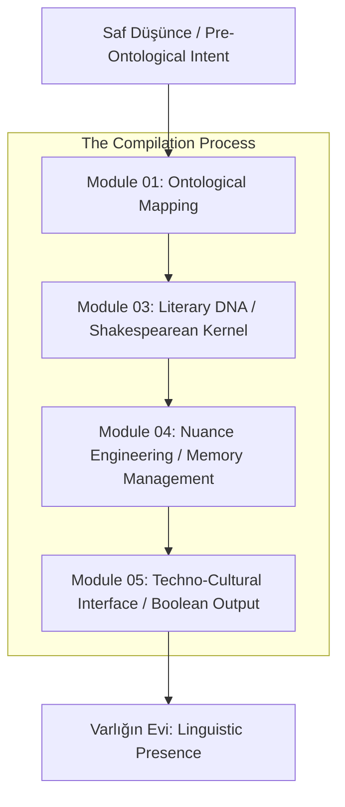
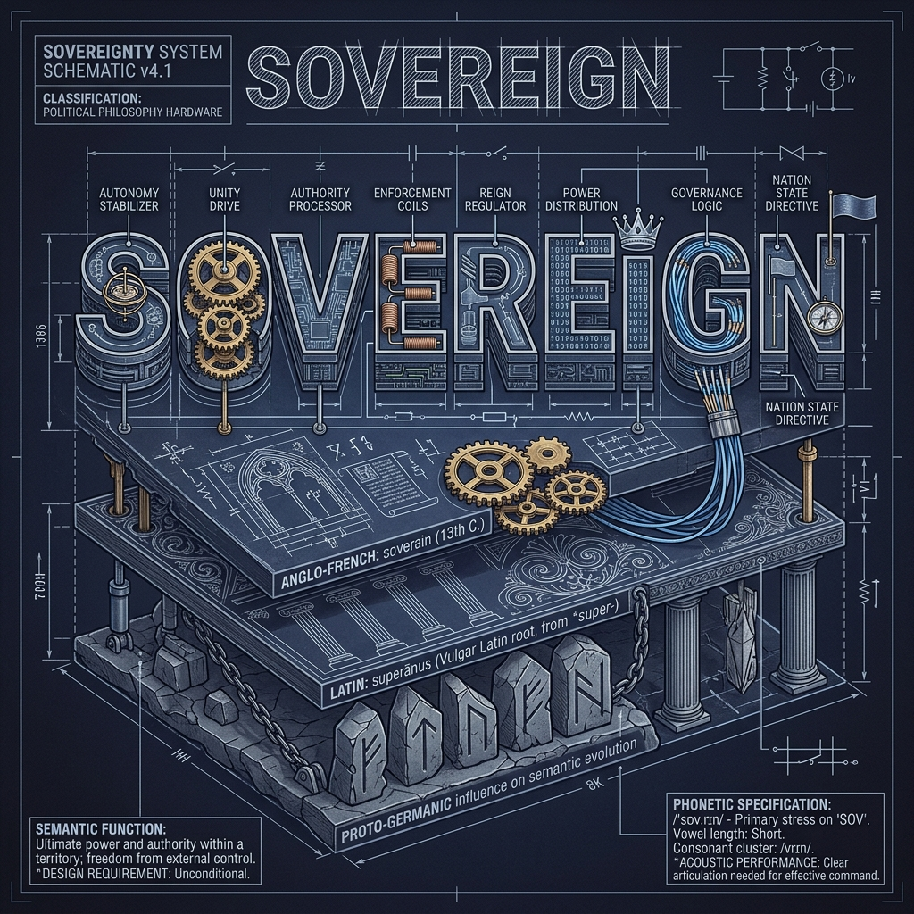

# 🏗️ Cultural-Syntax: Varlığın Evi Olarak İngilizce

> **"Dil, hakikatin evidir. İnsan, dilde ikamet eder."** — *Martin Heidegger*

---

## 🎯 Proje Manifestosu: Bilişsel Bir İşletim Sistemi Olarak İngilizce

Bu depo, alışılagelmiş bir dil öğrenme rehberi değildir. İngilizceyi yalnızca bir iletişim aracı değil, algıyı, mantığı ve kültürel etkileşimi şekillendiren **düşük seviyeli bir bilişsel işletim sistemi (Linguistic OS)** olarak ele alır. Bu proje, dilsel yapıları "tersine mühendislik" (reverse engineering) yöntemiyle deşifre ederek, zihinsel mimarinizi yeniden yapılandırmayı hedefler.

---

## 🏗️ Sistem Mimarisi (The Linguistic Pipeline)

Bir düşüncenin saf enerjiden somut bir İngilizce cümleye dönüşüm süreci, bir derleyicinin (compiler) çalışma prensibine benzer:

---

## 📂 Operasyonel Modüller

| Modül | Teknik Odak | Dokümantasyon |
| :--- | :--- | :--- |
| **01 [Ontolojik Temeller](01_Ontolojik_Temeller/)** | Dilin "Assembly" katmanı. Özne-Yüklem-Nesne mantığı. | 🟢 Tamamlandı |
| **02 [Denizci Etimolojisi](02_Denizci_ve_Endüstriyel_Etimoloji/)** | Dilin altyapı komutları. Denizcilik ve sanayi kodları. | 🟢 Tamamlandı |
| **03 [Edebiyat İşletim Sistemi](03_Edebiyat_İşletim_Sistemi/)** | Shakespearean DNA ve 1700+ çekirdek fonksiyon. | 🟢 Tamamlandı |
| **04 [Nüans Mühendisliği](04_Nüans_Mühendisliği/)** | Register switching ve bellek yönetimi (Nuance). | 🟢 Tamamlandı |
| **05 [Tekno-Kültürel Arayüz](05_Tekno-Kültürel_Arayüz/)** | Boolean mantığı ve İngilizcenin yerel syntax uyumu. | 🟢 Tamamlandı |

---

## 👁️ Kelime Anatomisi: Teknik Bir Analiz

Bir kelime, sadece bir ses dizisi değildir; binlerce yıllık evrimsel verinin sıkıştırılmış bir donanım parçasıdır.

---

## 🚀 Hızlı Başlangıç (Quickstart)

1.  **Çekirdeği Başlatın:** `01_Ontolojik_Temeller` altındaki `being.asm` dosyasını inceleyerek dilin varoluşsal syscall'larını anlayın.
2.  **DNA'yı Deşifre Edin:** `03_Edebiyat_İşletim_Sistemi` içinde Shakespearean fonksiyonların modern dile nasıl 'inline' edildiğini görün.
3.  **Kernel'i Derleyin:** `05_Tekno-Kültürel_Arayüz` altındaki `cognitive_kernel.rs` ile zihinsel mantık kapılarınızı güncelleyin.

---

**arch-yunus tarafından ⚔️ ve 🧠 ile geliştirilmiştir.**