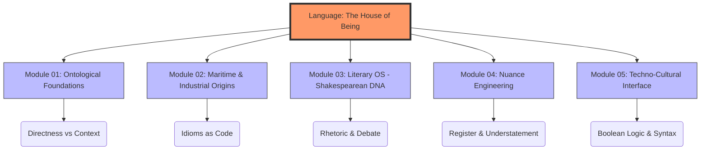

# 🏗️ Cultural-Syntax: Varlığın Evi Olarak İngilizce

---

## 🎯 Proje Manifestosu: "Dil, Hakikatin Evidir"

Bu depo (repository), alışılagelmiş bir dil öğrenme rehberi değildir. Martin Heidegger’in *"Dil, varlığın evidir"* önermesinden yola çıkarak; İngilizceyi yalnızca bir iletişim aracı değil, algıyı, mantığı ve kültürel etkileşimi şekillendiren bir **bilişsel işletim sistemi** olarak ele alır.

Bir dili, o dili doğuran kültürden bağımsız öğrenmek; bir programlama dilinin mimarisini bilmeden sadece sözdizimini (syntax) ezberlemeye benzer. Bu proje, **dilsel yetkinliği (Linguistic Proficiency)**, **kültürel zeka (CQ)** ile entegre ederek İngilizceyi bir "sistem mimarı" derinliğiyle kavramayı hedefler.

---

## 🏛️ Mimari Yapı: Katmanlı Analiz

Repo, dilin ve kültürün farklı katmanlarını temsil eden beş ana modülden oluşmaktadır:

### 1. `01_Ontolojik_Temeller/` (Linguistic Ontology)
*   **Doğrusallık ve Zaman Okulu:** Batı'daki "Zaman Paradigması". İngilizcedeki zaman yapılarının (Tenses), eylemi nasıl parçalara böldüğü ve birer "zaman bloğu" olarak nasıl mimari bir öğeye dönüştürdüğü analizi.
*   **Özne Merkezli Dünya:** İngilizce cümlenin merkezindeki "I/Subject" egemenliğinin, bireycilik ve sorumluluk bilinci üzerindeki etkileri.
*   **Context vs. Content:** Yüksek bağlamlı (Doğu) ve düşük bağlamlı (Batı) kültürlerin iletişim protokolleri arasındaki farklar.

### 2. `02_Denizci_ve_Endüstriyel_Etimoloji/` (The Historical Engine)
*   **The Maritime Protocol:** İngilizcenin denizcilik terimleri üzerinden nasıl bir "emir-komuta ve hayatta kalma" dili haline geldiği.
*   **Sanayi Devrimi ve Verimlilik:** Buharlı makinelerden seri üretime; dilin nasıl mekanikleştiği ve "Input/Output" mantığının dile sızışı.
*   **Global Lingua Franca:** Bir dilin yerellikten çıkıp nasıl bir "evrensel işletim sistemi protokolüne" dönüştüğü.

### 3. `03_Edebiyat_İşletim_Sistemi/` (Literary OS)
*   **Shakespearean DNA:** Modern İngilizcenin temel taşlarını oluşturan 1700+ kelimenin, modern düşünce yapısını nasıl inşa ettiği.
*   **Retorik ve İkna Mühendisliği:** Antik Yunan'dan modern İngiliz siyasetine; bir fikri "satma" ve "savunma" sanatının dilsel kodları.
*   **Distopik Semantik:** Orwell ve Huxley'in dilleri; kelimeler azaldıkça düşünce özgürlüğünün nasıl daraldığının teknik analizi.

### 4. `04_Nüans_Mühendisliği/` (The Nuance Interface)
*   **Understatement (Hafifletme):** *"It's not ideal"* cümlesinin aslında *"Bu bir felaket"* anlamına geldiği kültürel çeviri katmanları.
*   **Euphemism & Social Engineering:** Gerçeği örtme ve nezaket dilinin toplumsal mühendislikteki rolü.
*   **Latince-Germen Hiyerarşisi:** Akademik dil (Latince kökenli) ile sokak dili (Germen kökenli) arasındaki geçişkenlik ve statü kodları.

### 5. `05_Tekno-Kültürel_Arayüz/` (Digital Synapsis)
*   **Coding in English:** İngilizce cümle yapısının neden Boolean mantığına (AND, OR, IF/THEN) bu kadar yakın olduğunun felsefi temelleri.
*   **Ar-Ge ve İnovasyon Dili:** Neden en büyük teknoloji şirketleri ve bilimsel makaleler bu dili "default" kabul eder?
*   **Critical Thinking Framework:** İngilizce yazım kurallarındaki "Tez-Argüman-Sentez" yapısının, beynin çalışma şeklini nasıl "analitik" bir moda soktuğu.

---

## ⚙️ Operasyonel Protokoller (How to Use)

Bu depo, pasif bir okuma alanı değil, aktif bir **bilişsel laboratuvardır**:

1.  **Deep Semantic Analysis:** Bir metni okurken sadece anlamını değil, seçilen kelimelerin etimolojik kökenlerini ve neden o bağlamda kullanıldığını "tersine mühendislik" (reverse engineering) yaparak analiz edin.
2.  **Linguistic Emulation:** Günlük düşünce akışınızı, hedef dilin mantık süzgecinden (Active voice, Subject-Verb-Object) geçirerek yeniden yapılandırın.
3.  **Cross-Disciplinary Connection:** Öğrendiğiniz her dilsel yapıyı bir tarihsel olayla veya bir teknolojik kavramla eşleştirin.

---

## 🧠 Nöral Arayüz: Dil Beyni Nasıl Değiştirir?

Yeni bir dil öğrenmek, beyinde yeni "nöral patikalar" açmak demektir. İngilizce gibi analitik ve yapılandırılmış bir dili öğrenmek:
*   **Executive Function:** Planlama ve karar verme mekanizmalarını güçlendirir.
*   **Cognitive Flexibility:** Olaylara farklı açılardan bakabilme (Perspective taking) yeteneğini artırır.
*   **Information Density:** Daha az kelimeyle daha fazla teknik veri aktarma kapasitesini geliştirir.

---

## 🚀 Yol Haritası (Roadmap)

- [x] Temel mimarinin kurulması (Manifesto).
- [x] Modül içeriklerinin (01-05) ana hatlarıyla belirlenmesi.
- [ ] Etimolojik veri tabanının genişletilmesi.
- [ ] Etkileşimli Mermaid diyagramlarının (Grammar Logic) eklenmesi.
- [ ] Sesli/Görsel analiz kütüphanesinin (Shakespearean Speech) entegrasyonu.
- [ ] Topluluk katkılarıyla "Nüans Sözlüğü" oluşturulması.

---

## 📜 Öğrenme Felsefesi

> *"Yabancı dil bilmeyen, kendi dilini de bilemez."* — **Goethe**

İngilizceyi kültürüyle deşifre ederek sadece konuşmayı öğrenmiyoruz; dünyayı farklı bir mercekten algılamayı öğreniyoruz. Bu depo, küresel çağda kendi entelektüel krallığını inşa etmek isteyen **"Otodidakt Alimler"** ve **"Dijital Seyyahlar"** için tasarlanmıştır.

---

## 🤝 Katkı Sağlama

Bu proje, zihin için açık kaynaklı bir araştırma laboratuvarıdır. **Etnolinguistik**, **Etimoloji** ve **Teknoloji Felsefesi** konularındaki katkılara açıktır. Lütfen eklemek istediğiniz modülleri ve analizleri `Pull Request` olarak gönderin.

---

  <i>“Başka bir dile sahip olmak, ikinci bir ruha sahip olmaktır.”</i> 
  <strong>– Şarlman</strong>

